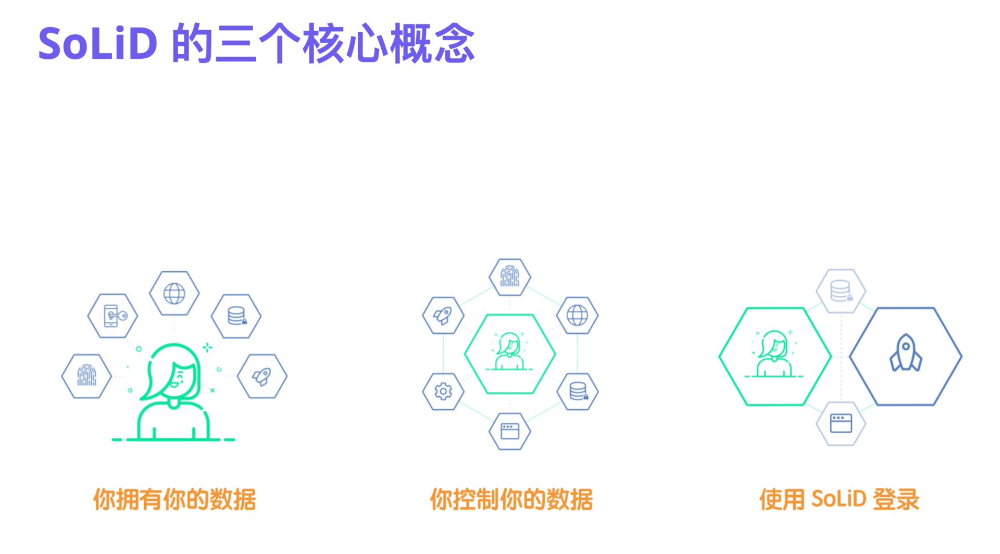
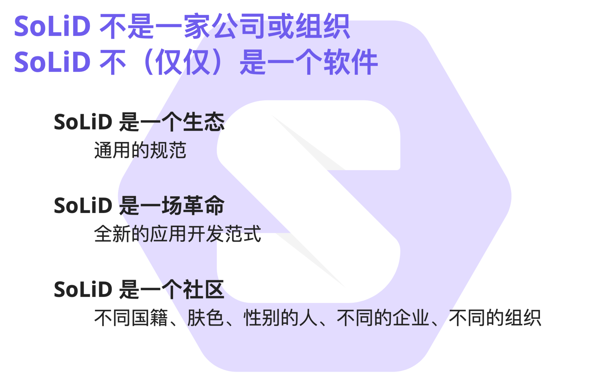
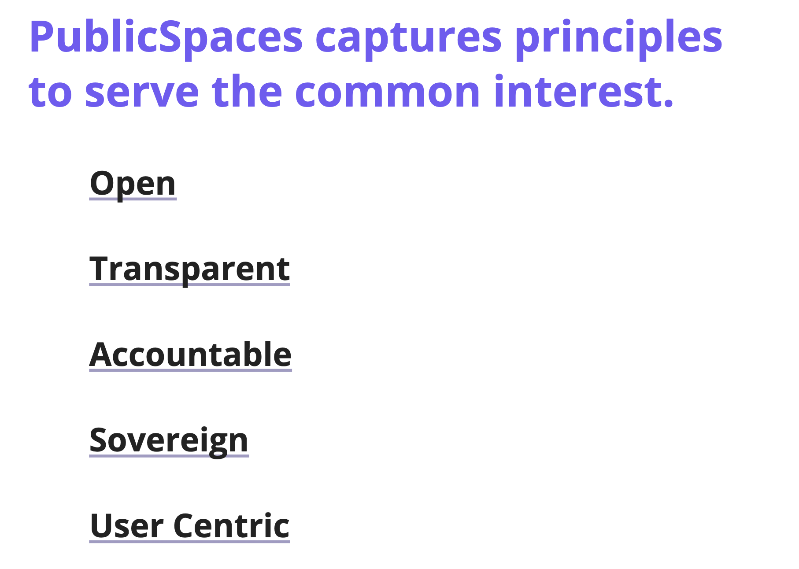

SoLiD 是由万维网之父 Tim 发起的一场数据主权革命。什么叫数据主权？很容易理解，现在我们的数据是把持在巨头手里的，你的微信通讯录和聊天记录都无法导出，不管是从人权角度还是从法理角度，这些数据应该都是属于你的，但是你没有控制权，SoLiD 要做的核心的一件事就是让这些数据归于用户控制。它带来了一种全新的开发范式，这个范式是啥我们接下来会有介绍。那么什么是革命？革谁的命？也非常清晰，就是革那些体大不尊的巨头的命。

<!-- more -->

> 本文整理自蒸汽记忆创始人谢扬在 2019 年 11 月 16 日在成都 Web 全栈大会上的演讲，内容有删改。
> 完整 PPT 可从 Github 上查看：[webfullstack-2019](https://leinue.github.io/webfullstack-2019/index.html)

那么在开始之前呢，我先按照惯例自我介绍下。我目前在创业，我们公司的名字叫做蒸汽记忆，取自工业革命的开始，我们想做提高社会的生产力的事情，并将全球的公开信息变成知识图谱。我们的使命是在一个身份下互联全人类的文化基因，构建全球互联的生产力平台。同时，我是 SoLiD 中文网的发起人，SoLiD 就是今天要讲的主题。在职业经历上，我是一名 Web 全栈开发者，其次也是知识图谱研究者。在创业之前，我曾经任职好东西传送门的 CTO，当时主要负责知识推荐和舆情分析等工作。在字节跳动时主要负责一款日活过亿的 Serverless 产品的研发和产品设计工作。

最后，我还是一名共产主义者。

那么下面，我们就开始进入 SoLiD 和数据主权革命的主题了。

在正式介绍 SoLiD 之前，我先介绍下 SoLiD 的发起人，万维网之父 Tim。他最大的贡献是制定了 HTML 语言和建立了 W3C 万维网联盟。这里我也推荐大家看一本书来更好的理解万维网之父建立 Web 的一个初衷，这本书的名字叫：《编织万维网 —— 万维网之父谈万维网的原初构想》。这本书呢，就介绍了万维网是怎么从一个实验室项目推广到全世界的。为什么我们现在要看这本书？因为现在就是一个巨头垄断的时代，万维网和互联网已经偏离了原本的设计，我们要回顾这些创作者的初心是啥，同时我们年轻一代的人也要从中发现新的机会。另外今年是互联网的五十周年，也是万维网的三十周年，那么再过三十年和五十年，互联网会变成什么样？这值得每个人去思考，尤其是开发者，互联网的建造者，命运是在你们手中的。Tim 对我们整个互联网的发展有着举重若轻的作用，假如没有 Tim，那么就现在的 Web，那么今天的大会也就没有了。

好，这是对 Tim 的一个介绍。

这句话是 2012 年伦敦奥运会的时候 Tim 发的一个 Twitter，This is for Everyone。这个意思呢，就是说，Web 作为一个有统一规范的生态，是对每个人都开放的，每个人都能从中平等的获取信息，这也是 Web 被创建的一个初衷。

那么再看这张图，主要就是现在的互联网巨头们。大家可以看到图片中间是一个人，在聚光灯下，无论是 Youtube 还是 Googkle 都在围着他转，上面还有摄像头，这个人的所有信息都在这些互联网巨头手里一览无余。这就是我们目前 Web 的一个现状 —— 巨头控制几乎所有的东西。

那么 SoLiD，今天我们这场分享的主角，就是用来重塑现有的互联网的一个有力工具。用 SoLiD，我们将重构人与数据和人与应用之间的关系。这个理解起来很简单，我们现在所有的应用和数据都是一种耦合关系，Google 有 Google 的数据库，Facebook 有 Facebook 的数据库，那么在 SoLiD 的设计中，Google 或者 Facebook 应用本身和数据应该是分离的关系，Google 可以读取 Facebook 的数据库，Facebook 也可以读取 Google 的数据库，而所有这些数据，都是由用户去控制，去授权的。有了 SoLiD，我们的 Web 会有一个新面貌出现。

首先我们来回顾下 Web 的原初构想。这里我想举一个我自己的例子，我在小学三年级第一次拥有了自己的电脑，相比周围的朋友同学是比较晚的，那么在这个时候我还是处于一种打游戏的阶段，电脑只是我的一个玩具。到了初中的时候，也就是 08 年 09 年，此时我发现了编程这件事情，让我非常的着迷。我从来没有攒过计算机硬件设备，我做的第一件比较专业的和计算机相关的事情是破解了家里的 ADSL，然后用 Discuz 搭建了一个网站。我记得我那个时候特别喜欢上微机课，每到微机课的时候，我都会在学校的电脑教室里打开我的网站，这个网站是一个 IP，然后向同学炫耀：「快看，这是我做的网站，这个服务器还是我家里的电脑！」此后，我还搭建了我的个人博客，从 09 年一直写博客到 19 年，整整十年。到了我高中的时候，也就是 12 年 13 年的时候，移动互联网开始逐渐的火热起来，此时很多事情就变得越来越奇怪了，大家开始讲流量生意，讲用户数据变现，互联网让我越来越陌生了。讲这么一个故事想说的是，Web 是一个非常公平的平台，连一个初中生都能在此基础上进行各种创新，这得益于统一的 W3C 标准和繁荣的生态。这非常符合 Web 在诞生之日就有的一个定位。

在十年前，是一个个人站长的黄金年代。我们当时做个人博客，个人博客里面链接了其他更多的个人博客，每个人都可以在不同的网站里面发表不同的评论，每个人都不需要作出任何妥协就可以发表自己的声音。Web 最重要的一个发明，超链接技术，现在已经被各大 APP 进行了无限度的分割。这里我一定要吐槽一下微信公众号不能插入超链接，腾讯这种吃相难看的绥靖政策，严重背离了 Web 的初衷，他们不是历史的推手，而是历史的倒退者。

Web 给予了每个人建立自己博客和网站的自由，每个人都可以在自己的网站或其他人的网站内分享他们的知识、见解和故事。Web 就相当于一个人的精神世界，Web 是从生活中来的，但是却高于生活。

而那些更好的帮助人与人之间进行连接的企业，也获得了很大成功，比如 flickr，last.fm 等。

正因为 Web 的自由性和无门槛，才促进了全球的创新。每个人都可以通过 Web 将自己的伟大想法告诉全世界。而开发者开发 Web 应用不需要得到任何人的许可，可以随时随地发布自己的创意。在这里，我还要吐槽微信小程序，微信小程序有两个非常大的缺点，一是严格的审核，这点我们都理解它最本质的原因。这种严格的审核，阻碍了大量优质的个人开发者上线优质的应用；二是其自创的语法，已经偏离 W3C 体系，他造了另外一个平行世界，加重了世界的熵。

小程序把本来一种开放的生态，变成了一种围墙，这是历史的倒退。

Web 的无门槛进入带来了大量创新，比如亚马逊、Twitter 等，这些大家都很清楚了。

诚然，这些大型企业给予了普通用户非常多的便利，但是我们的数据却都掌握在巨头手中。以前很多人写博客，现在很多人只写微博、发朋友圈。不错，我们拥有了很好的用户体验，但是我们丧失了对数据的控制权。我举个例子来说明我们为什么需要数据的控制权，假如你有一个知乎账号，有几十万粉丝，某一天因为某些事情被知乎封掉了账号，此时你所有的粉丝关系都因为知乎的单方面封禁而丢失了，粉丝其实是你生产的数据，但是却不被你掌控。最好的处理方式是，知乎只是被我授权了我的粉丝关系的一个应用，他封禁的只是我对他平台的使用权，但是我的粉丝关系其实还存在我这边，我还可以授权给微博、微信等。说到粉丝关系，就会有另外一个概念，粉丝是为了什么？是为了推送，因此 SoLiD 也有一个 websocket 推送规范，这些推送可以推送给你的好友列表，不依赖任何应用程序。

另外一个问题就是隐私泄漏问题，2018 年 Facebook 剑桥分析事件泄漏了 5000 万用户数据，最近 Facebook 又泄漏了 7000 页的用户数据使用条款，该条款说明了 Facebook 如何挟持用户数据杀死竞争对手。在今年年初，杭州一家爬虫公司被封，该爬虫公司爬取了中国八亿人的简历，每年获利上亿。我自己也有亲身经历，最近有猎头找到我，我问她怎么找到我的，她说在某网站上看到我的简历，但是我从未用过那个网站。

尤其是各种各样的小程序，我们认为这严重损害了 Web 的通用性，主要在于他们在商业载体下的封闭性。

大家也可以看看这张图，图里面各大社交公司筑起了自己的高墙，在不同的社交网络中切换时极其复杂。而上面西装革履的大公司资本力量，淡然的看着这一切，这就是我们 Web 的现状。

在这样一个巨头把持数据的中心化时代，严重伤害了多元性、创新性和选择性。

这里我想问大家一个问题，如果你只能创建一个应用，那么你会选择做 weixin.com 还是 identity-provider.org? 我猜大多数人会选择做 weixin.com，这里面理由非常多，更大，更全，普通用户更容易感知等。如果是我，我会选择做 identity-provider.org，这是一种范式的转变，变成了以用户身份为中心，然后围绕用户身份做一系列的创新。身份是一个非常复杂的事情，做得好很不容易。

我拒绝开发小程序应用，因为他太封闭了。

下面我们来详细讲一下基于 SoLiD 的开发范式转变以及 SoLiD 如何重塑互联网用户和互联网数据之间的关系。

SoLiD 的核心可以归纳为三点，第一点：你拥有你的数据。你可以自由决定你的数据存储到哪里以及怎么导出。这些数据，不限于你的通讯录，你的日程表，你的聊天数据，你喜欢的文章，你点赞的评论等等。这些数据都是归你所有的。你会有一个叫做 Pod 的东西，你可以将其理解为一种可编程的网盘，所有的应用程序读写都会在你的网盘里进行。在 A 应用中存储的数据，B 应用也可以访问，你不需要手动同步，因为这些数据会永远跟着你。

那么第二点，就是你控制你的数据。你可以决定你的数据有哪些服务商可以读写，以及什么时候不能读写。可以把这点理解成支付宝或者微信支付的免密支付。你可以授权滴滴打车之后自动扣款，你也可以将自动扣款能取消，你就将数据看成你的个人财产就好。

第三个就是使用 SoLiD 登录，也就是用户在 SoLiD 生态中唯一的身份。通过这个身份，你可以直接登录任意支持 SoLiD 的应用，并且可以将这个账号背后的数据授权给任何你想授权的应用。

以上三点就是 SoLiD 的核心价值。

如果要更好的理解 SoLiD，还需要理解四个核心概念。

我们知道，SoLiD 的英文全称是 Social Linked Data，所以我们需要理解什么是 Social，为什么 SoLiD 会有社交的想法？以及什么是 Linked Data，为什么数据需要互联？

那么理解 SoLiD 之前，我们先理解下什么是 PoD，PoD 的全称是 Personal Online Data，也就是个人在线数据的意思，在 SoLiD 中就是存储数据的地方，你可以将 PoD 理解为一个个人网盘。

那么这个个人网盘可以存储任何东西，结构化的，非结构化的，都可以存储。什么叫结构化的，比如，我喜欢的文章，我点赞的朋友圈，我的好友关系，这些都是结构化的。那么非结构化的，就是我的图片、我的笔记等等。

所有应用的数据读写，都是在每个用户的 PoD 中进行，同时每个人都有一个 WebID，这个 WebID 后面关联着你的所有数据。

WebID 也是一个规范，这里就不展开了，展开的话就没完没了，大家可以简单把他理解为一个唯一性 ID。

那么第二个需要理解的，就是本体。前面我也简单的介绍了一下。这里我再稍微提一点。大家看上面的图，首先看我们这个蝙蝠侠，他有头罩，有披风，还有腰带、鞋子等等。那么这些名词，都叫做本体，本体定义了头罩只能叫头罩，而不能叫帽子。再看海绵宝宝，他有皮肤，有眼珠有裤子有斑点，大家还可以看到斑点在皮肤上，那么在这种关系也叫做本体。除了在这种关系，还有像拥有啦，上面啦等等。最右边的呢，是达尔文 core，他是一个植物的本体，植物的本体是有限的一个集合，所以很多人拿它来做研究。

第三个，就是 SoLiD 全称中的 Social 的含义。我们都知道，微信的用户是没有办法和 QQ 的通讯录统一的，你需要重复添加，那么 SoLiD 就定义了一种开放的社交关系图谱，叫做 FOAF，全称是 Friend of a friend，也就是朋友的朋友。比如我认识 A，A 认识 B，那么我就有可能会认识 B。这也是一种三元组的关系集合。大家经常用的企查查其实就是一种 FOAF。SoLiD 是一个以用户和个体为中心的一个生态，所以其必不可少的描述了一种社交关系。FOAF 也是 W3C 的一个标准，他描述了社交关系里的所有本体，SoLiD 直接拿来用了。

了解完社交之后，我们再看最后一个点，Linked Data。大家这么来看 Linked Data 就很好理解。刚才说的 FOAF 是用来描述人的，那么人背后需要的数据，就是通过 Linked Data 来描述的。Linked Data 是语义网技术的一个集合，所谓 RDF、OWL 等一系列变体。

SoLiD 带来的东西除了刚才讲的核心价值之外，还有有开发范式的变化。在以前，我们开发一个应用需要自己搭数据库，运维服务器，然后做用户系统，再将用户 ID 与数据关联。有了 SoLiD 之后，这些全都不用做了，SoLiD 会变成互联网上缺失的身份层和数据传输存储层。

首先第一点，就是数据存储方式的变化。大家可以看到右边的这张图，这张图是假设一个人在阅读一篇文章，那么在阅读这篇文章的时候，这篇文章的标题、作者、头像以及内容，不是从一个中心化服务器中读取的，而是从这个作者的 PoD 中读取的。同时，当我喜欢这篇文章，并且点了个赞的时候，这个点赞的记录是存在我自己的 POD 里面的，这就是与传统软件开发最根本的区别。

讲完数据写入之后，我们来看一下数据读取。还是看这张图，左边是 Facebook、Linkedin 这种数据和应用紧耦合的关系，右边是 SoLiD 架构下的结构图，大家可以清晰的看到，不管是图片管理软件，还是社交应用的 feed 流，还是日程管理软件，都是从用户自己的 PoD 中去读取的。

这就是 SoLiD 带来的，数据读取和写入的这样一个变化。

那么最后一个范式的变化就是创新者入局的变化。因为 SoLiD 带来的数据确权，使数据可以重复利用，在 A 应用上生产的数据，在 B 应用上也可以使用，应用间可以无缝互联，这让数据不再是创新壁垒，壁垒在于谁能够提供更好的服务以及谁能够取得用户的信任。

任何一家初创公司都可以快速重复利用现有非隐私数据时，我相信市场的创新活力会有更大的激发。

SoLiD 给我们带来的，不仅是一个开源软件，也不仅仅是一个在此开源软件上进行商业化的公司，而是一个通用的生态，生态里的应用都遵循着同样的范式。同时也是一场革命，这场革命不仅带来了全新的应用开发范式，还将从根本上解决用户数据的所有权问题。

搭建 SoLiD 的服务器非常容易，SoLiD 的服务器主要承担着 SoLiD Pod 的托管作用和一个 HTTP Server 的作用，此 HTTP Server 基于 RESTful 对外提供服务。大家可以把 SoLiD 服务器想象成一个能聚合全球计算能力的 Linux 计算机，这台计算机的计算能力由浏览器承担，数据库能力由整个 Web 承担，聚合查询的时候使用 SPARQL 或 GraphQL 进行查询。如果想要写入文件等非结构化数据，只需要使用符合 RESTful 规范的 POST、PUT、GET 等请求方式进行请求就可以执行创建文件夹、增加文件、删除文件、修改文件等操作。

同时 SoLiD 还有 WAC（Web Access Control） 这样一个控制权限的协议，可以进行粒度很细的权限分配操作，其控制的粒度和 Linux 一样细。

基于 SoLiD 的应用，不是说数据在硬件层面被用户所控制，而是从逻辑角度来看，是由用户控制的。这个意思就是说，SoLiD 服务器不是一定要放到用户自己家里，他可能还在云上，或者其他免费的社区版本。

下面再谈一谈 SoLiD 的设计原则，主要就是五个原则：Open、Transparent、Accountable、Sovereign 和 User Centric。SoLiD 是开源的，其不受任何政府、组织控制；SoLiD 整个研发流程是透明的，每个人都可以 Reivew 所有的 Pull Request 和代码；SoLiD 是负责任的，其平台设计的目的就是让用户拥有自己的数据，平台本身并不拥有；SoLiD 是为了主权所设计的，赋能用户的优先级永远是最高的；SoLiD 也是以用户为中心的，它的整个生态从开始设计时就是以隐私为核心。

聊完了 SoLiD 的一些基础后，我们再从开发者角度看看 SoLiD 整个项目的易用性。使用 SoLiD 开发后，应用从只有一个后端变成拥有多个后端。

在传统的中心化模型中，App 有一个后端，从一个后端中读取多个数据。但在 SoLiD 这种去中心化的模型中，应用 X 和应用 Y 从不同的 Data Pod 中读写数据，每一个 Pod 中都存着不同人的数据，同时 Pod 与 Pod 之间还可以做很多交互。

假如有很多 Pod，那么就会产生 Pod 的互操作性问题，比如如何在多个不同的 Pod 之间做联合查询。在传统的数据库模型中，可以用 Join 等关键词在不同的表中做联合查询，那么 Pod 之间的联合查询，也同样可以做到，只不过 Pod 之间的查询是基于网络的，而不是在内存中。

SoLiD 使用 JSON-LD 来对不同的数据片段进行互联。

JSON-LD 是一种简化的 RDF 表示语言，以下是 JSON-LD 和 Turtle 的区别：

可以看到，JSON-LD 比 Turtle 简单易懂的多。

以上就是 SoLiD 开发体验的介绍，总结下来就是一句话：「从学术化到工程化」。

聊完开发者体验，我们再来看一看数据民主之路的必然趋势。我们认为互联网是人类社会发展的一个缩影，数据民主是必由之路。我们先看人类社会的一个发展，从一开始的采集社会，人类产生了各个部族群落，此时相对于个人博客和网站的开垦期；再到农业革命，产生了帝国番邦，对应了如今美国的 FLAG、中国的 BATTMD；后来，人类发生了工业革命，这是一场影响深远的革命，不仅改善了人类的生活条件，还产生了一些其他政治上的影响。而如今，互联网的生产力还远远未得到释放，云计算、AI 和区块链都还处于一个很早期的阶段，如果到了某一天，AI 的机器智能大幅提高，能够辅助人类做决策之时，就是互联网数据主权革命将要开始的时候。因为那时，你的数据就是你的思想，就是你的生命，你自然是不想让任何人来控制你身体的某一部分。

最后，我们聊一聊 SoLiD 可能带来的几个大的商业机会。

第一个机会就是身份提供商，身份是一个从计算机存在以来就有的问题，大家可能觉得他被解决的很好了，其实没有被解决好。现在无论是互联网还是工业互联网，抑或是企业内部的环境，所有的身份实现都是不标准的，混乱的，这种混乱每年带来数百亿人民币的浪费。如果谁能推动身份标准化同时能有成熟的产品推向市场，这是一个巨大的机会。为什么要切中身份？因为在 SoLiD 里，所有事情都是围绕身份来的，只有身份这个基础设施做好了，才有后面的一切。

第二个机会是「个人数据管理平台」。那么什么是「个人数据管理平台」呢，这个也很容易理解，既然你的所有数据都存在 POD 中，那么肯定需要一个集中化的软件来做所有结构化数据和非结构化数据的管理和控制，这种软件的开发难度是非常大的，因为要兼容所有数据类型，你可以把他理解为更普适化的 Excel。这里我要介绍一类产品，我们叫他模块化生产力软件。模块化生产力软件最重要的一个特点是「用文档来表示所有信息」。说到文档，你们最先想到什么？是 Word 对吧。事实上，计算机文档的结构从上世纪 70 年代到现在都没有任何变化。但是世界上的所有其他软件都发生了变化，不管是手机还是电脑。

换句话说，模块化生产力软件将有可能颠覆 Office 的竞争格局。

另外一个就是为什么我们要用文档来表示所有信息，因为世界上所有的软件内部的信息组成都是文档。人类历史的开端就是人类学会了在石头上写文档。计算机出现后，人类进入了电子文档时代，这让知识开始在全球范围内快速传播。即使是微信的聊天框、微博的 feed 流，或者是抖音的视频，都是文档的一种表现形式。

另外一个关键词是「模块化」，为什么要叫他模块化呢？这里我要引入一个新概念，叫做「文档即应用」，就是你所写的文档，将会变成一个可执行的应用，你可以任意修改任何应用的任意信息和界面布局。

那么当这类软件成熟起来之后，将可以用来管理 SoLiD 里面所有的个人数据。目前这类软件我最看好的是 coda.io coda.io。他为什么好？我也举个简单的例子，大家都知道 Excel 严格意义上来讲可以做任何事情，那么为什么还会有 odoo 这类 erp 软件或者 salesforce 这类 crm 软件出来呢？很简单，因为企业的业务流程，用 excel 很难实现一个用户体验良好的自动化，这类软件的意义就在于将流程自动化出来。但是他们本身的数据控制没有 excel 那么自由。coda，就是将 excel 对数据的控制自由和业务流程的自定义自由很好的结合了起来。

我写过一篇文章，叫 「文档将重塑全球生产力」，在微信公众号和搜狗上都能搜到，这篇文章有更多关于模块化生产力软件的介绍，大家有兴趣的话可以搜索看一看。

那么最后一个，就是「以身份为中心的计算平台」。怎么理解呢？就是做一个操作系统，但是这个操作系统不再以管理计算机资源为中心，而是以用户和服务为中心。

可以简单理解为在这个操作系统内有一个 ID，然后可以登录操作系统内 App Store 的所有应用程序，同时这些应用程序之间的数据都是可以互联的，这时候才会产生真正的个人助理，这才是真正的互联网。

做这么一个计算平台本身，难度不大。真正的难度在于如何推广出去。首先，我们都十分确定这绝对是未来的一个发展趋势，那么是现在做还是将来做？是我们做还是其他人做，这是非常值得思考的一个问题。

我们能想到的一些 Marketing 策略就是首先针对三大运营商的高端人群，同时对隐私十分关注的一群人，卖下一代黑莓手机，这些资源是我们目前能接触到的资源。有了这种下一代黑莓手机，那么无论是像 Maskbook 这种应用还是其他的区块链类隐私应用，才有推向市场的可能性。

> 本文整理自蒸汽记忆创始人谢扬在 2019 年 11 月 16 日在成都 Web 全栈大会上的演讲，内容有删改。
> 完整 PPT 可从 Github 上查看：[webfullstack-2019](https://leinue.github.io/webfullstack-2019/index.html)
